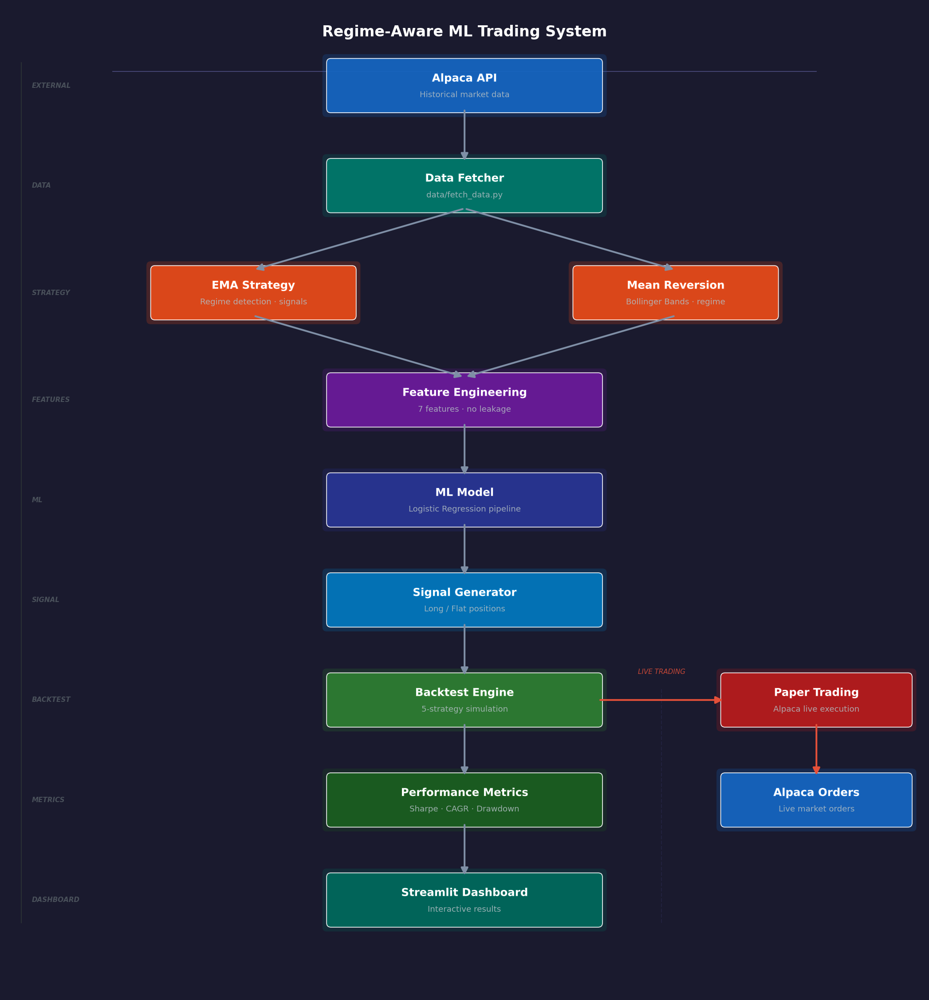

# Regime-Aware ML Trading System

> A modular algorithmic trading system combining regime detection, EMA crossover, and machine learning to generate smarter, context-aware trading signals.


---

## Overview

This system trades five US equity symbols (AAPL, MSFT, NVDA, SPY, QQQ) using a layered signal architecture. Raw OHLCV data from Alpaca is transformed into regime labels, technical features, and machine learning predictions — each layer filtering and refining the raw signal before a position is taken. A backtest engine with transaction costs evaluates all five strategies on a held-out 30% test period, and a Streamlit dashboard makes results interactive without requiring any notebook setup.

The central insight driving the system is that markets alternate between trending and choppy regimes, and most quantitative strategies perform radically differently across these two states. A simple moving average crossover that thrives in a trending market will churn and bleed in a sideways one. By detecting regime using rolling linear regression on log prices — and gating every strategy behind a slope and R² threshold — the system only trades when market structure supports the strategy's assumptions.

What separates this from a standard backtest project is the full vertical slice from raw data to live execution. The ML pipeline enforces strict no-leakage discipline with time-based splits and scaler fitting only on training data. Walk-forward validation tests whether the model's edge is real or an artifact of in-sample overfitting. A paper trading module connects to Alpaca's live paper environment and executes signals from saved models, with duplicate-order guards and market-open checks. A Streamlit dashboard ties everything together for interactive exploration.

---

## Architecture



| Module | Responsibility |
|---|---|
| `data/` | Fetches OHLCV bars from Alpaca Historical Data API and returns a DatetimeIndex DataFrame |
| `strategy/` | Applies EMA crossover, mean reversion signals, and ML-based position generation |
| `features/` | Builds the 7-feature matrix and binary target with strict leakage prevention |
| `models/` | Trains the Logistic Regression pipeline, generates probabilities, and saves/loads models |
| `backtesting/` | Runs the return simulation with transaction costs, equity curves, and performance metrics |
| `paper_trading/` | Fetches live signals from saved models and submits market orders via Alpaca Trading API |
| `utils/` | Shared logger setup and chart generation |
| `config.py` | Single source of truth for all parameters — edit here before touching any other file |
| `app.py` | Streamlit dashboard with interactive backtest, walk-forward, and live positions tabs |

---

## Strategies Implemented

### 1. EMA Crossover with Regime Filter
The short EMA (10-day) crossing above the long EMA (20-day) generates a long signal, but only when price is above the 200-day EMA and the market is in a trending regime. The strict regime thresholds (slope > 0.0007, R² > 0.6) mean this strategy sits in cash during choppy markets, which is precisely where most trend-following losses occur.

### 2. ML Strategy — Logistic Regression
A scikit-learn Pipeline (StandardScaler → LogisticRegression) is trained per symbol on the 70% training split and predicts the probability of an upward move tomorrow. A long position is taken when predicted probability exceeds 0.55, with no regime gate applied — the regime flag is included as a feature, so the model learns its relevance implicitly.

### 3. ML + Regime Filter
The same ML signal as above, but gated behind a soft regime filter (slope > 0.0003, R² > 0.3). This eliminates trades in the most obviously sideways markets while giving the model more room to act than the strict EMA thresholds would allow. On symbols where the ML edge is real (AAPL), this variant improves risk-adjusted returns over pure ML.

### 4. Mean Reversion — Bollinger Bands
Enters long when price crosses below the lower Bollinger Band (20-day, 2σ) while the market is in a non-trending regime (regime == 0), and exits when price crosses above the upper band or the regime flips to trending. The regime gate is inverted here deliberately: mean reversion works best in the sideways conditions where trend-following fails.

### 5. Buy & Hold (Benchmark)
Holds a long position for the entire test period with no signal logic. All strategies are evaluated against this baseline — any strategy that fails to beat buy-and-hold on a risk-adjusted basis does not justify the additional complexity and transaction costs.

---

## Regime Detection

Regime is detected by fitting a rolling linear regression over a 20-day window of log-transformed closing prices. This produces two statistics per bar: the slope of the fitted line (measuring directional drift) and the R² (measuring how well the trend explains price movement over that window).

A bar is classified as **regime 1 (trending)** when both conditions hold simultaneously:

```
|slope| > threshold  AND  R² > threshold
```

The absolute value of slope catches both uptrends and downtrends — the system only cares whether price is moving consistently, not which direction. R² acting as a second gate ensures the slope reflects a genuine linear trend rather than noise that happens to have a non-zero gradient.

**Two separate threshold pairs are used:**

| Strategy | Slope Threshold | R² Threshold | Rationale |
|---|---|---|---|
| EMA | 0.0007 | 0.6 | Strict — EMA crossovers need clean, well-defined trends to avoid whipsawing |
| ML | 0.0003 | 0.3 | Soft — the model already sees regime as a feature; the external gate only needs to filter extreme choppiness |

Using different thresholds for the two strategies prevents the ML + Regime variant from spending too much time in cash, which would eliminate the ML edge on symbols where the model has genuine predictive power.

---

## ML Pipeline

### Features (7 total)

| Feature | Description | Leakage Risk |
|---|---|---|
| `return_1d` | 1-day price return | None — uses today's close |
| `return_3d` | 3-day price return | None |
| `return_5d` | 5-day price return | None |
| `volatility_10d` | 10-day rolling std of daily returns | None — rolling window is backward-looking |
| `ema_distance` | `(close − EMA_200) / EMA_200` | None — EMA uses only past prices |
| `zscore_20d` | Z-score of close vs. 20-day rolling mean/std | None |
| `regime` | Trending/choppy label from rolling regression | None |

### Target Definition

The target is a binary label: **1** if tomorrow's return is positive, **0** otherwise. It is created using `shift(-1)` on the close price, which legitimately looks one day into the future — this is correct because the target *is* tomorrow's outcome. `shift(-1)` is **never** used anywhere in the feature engineering code.

### Leakage Prevention

The pipeline enforces a strict no-leakage discipline across three layers:

**1. Time-based split only.**
The dataset is never shuffled. Training data is strictly the first 70% of the time series; the held-out test set is the final 30%. No random sampling, no cross-validation with shuffled folds.

**2. Scaler fit on training data only.**
The `StandardScaler` inside the `sklearn.Pipeline` is fit exclusively on `X_train`. When `model.predict_proba(X_test)` is called, the pipeline applies the training-time scaling parameters — the scaler never sees test statistics.

**3. Bollinger Bands computed before splitting.**
The mean reversion strategy requires a 20-day rolling window that would produce warm-up NaNs at the start of the test period if applied after splitting. Bollinger Bands are computed on the full dataframe before the train/test split, so the test period begins with a fully warmed-up rolling window and no lookahead.

### Model Choice

Logistic Regression was chosen deliberately over more complex alternatives (XGBoost, neural networks) for three reasons: it is interpretable, it trains in milliseconds on 1000-row datasets so per-symbol and per-fold training is fast, and it is less likely to overfit on a small feature set. The `max_iter=1000` setting prevents convergence warnings without affecting model behaviour; `random_state=42` ensures reproducibility.

---

## Results

All results are from the held-out 30% test period (~450 trading days). A transaction cost of 0.1% is applied on every position change.

### Per-Symbol Best Strategy

| Symbol | Best Strategy | Sharpe Ratio | Total Return |
|---|---|---|---|
| AAPL | ML Only | 1.26 | 34.98% |
| MSFT | EMA Strategy | 1.95 | 19.77% |
| NVDA | Mean Reversion | 0.78 | 24.23% |
| QQQ | EMA Strategy | 1.52 | 15.61% |
| SPY | EMA Strategy | 0.40 | — |

> **SPY note:** No ML edge was found on this broad-market index. The ML model produced Sharpe near zero on SPY's test period — consistent with the efficient market hypothesis holding more strongly for diversified index ETFs than for individual equities with more idiosyncratic structure.

### Walk-Forward Validation — AAPL

Walk-forward validation splits the full dataset into 5 sequential folds, training on all data before each fold and testing on that fold. This tests whether the ML edge is stable across time or concentrated in one lucky in-sample period.

| Fold | Sharpe |
|---|---|
| 1–3 | Variable (early, smaller training sets) |
| 4 | **1.13** |
| 5 | **0.83** |

Folds 4 and 5 show positive and strengthening Sharpe as the model accumulates more training history, which is the expected signature of a real signal. Performance degrading in later folds would suggest overfitting; improvement suggests the model benefits from additional data and that a longer history would strengthen the edge further.

---

## Honest Limitations

**No ML edge on index instruments.**
SPY and QQQ showed near-zero ML Sharpe on the test period. Index ETFs are more efficiently priced than individual equities, and the 7-feature set does not capture the cross-asset and macro signals needed to trade them systematically.

**Logistic Regression may be too simple for complex regimes.**
The model is linear in the feature space after scaling. Non-linear interactions between regime, momentum, and volatility likely exist but are not captured. A model with higher capacity (e.g., Random Forest) could extract more signal at the cost of interpretability and overfitting risk.

**1500 days of data limits walk-forward depth.**
With 5 folds across approximately 6 years of data, each fold covers roughly 14 months. This is enough to observe a signal but not enough to validate performance across multiple full market cycles, including extended bear markets.

**Paper trading only — not validated with real execution.**
The paper trading module uses Alpaca's simulated environment, which fills market orders instantly at the quoted price. Real execution involves slippage, partial fills, and latency that will reduce realized performance relative to both backtest and paper results.

---

## Setup & Installation

### Prerequisites
- Python 3.11+
- An [Alpaca Markets](https://alpaca.markets) account (free) with API keys for both historical data and paper trading

### Install Dependencies

```bash
git clone https://github.com/your-username/regime-aware-ml-trading-system.git
cd regime-aware-ml-trading-system

python -m venv .venv

# Windows
.venv\Scripts\activate
# macOS / Linux
source .venv/bin/activate

pip install alpaca-py scikit-learn pandas numpy matplotlib plotly streamlit python-dotenv joblib
```

### Environment Setup

Create a `.env` file in the project root:

```env
# Alpaca Historical Data API (backtesting and feature engineering)
API_KEY=your_alpaca_data_key
SECRET_KEY=your_alpaca_data_secret

# Alpaca Paper Trading API (live paper execution)
ALPACA_PAPER_KEY=your_alpaca_paper_key
ALPACA_PAPER_SECRET=your_alpaca_paper_secret
```

> Data API keys and Paper Trading keys are separate credentials — both are available free from the Alpaca dashboard.

### Running the System

**Full backtest pipeline** (fetches data, trains models, saves to `artifacts/`):
```bash
python main.py
```

**Interactive Streamlit dashboard:**
```bash
streamlit run app.py
```

**Paper trading execution** (requires saved models from `main.py`):
```bash
python paper_trading/execute_trades.py
```

Logs are written to `logs/trading.log` at DEBUG level and to the console at INFO level.

---

## Project Structure

```
regime-aware-ml-trading-system/
│
├── app.py                          # Streamlit dashboard — backtest, walk-forward, live positions
├── main.py                         # CLI entry point — runs full pipeline for all symbols
├── config.py                       # All parameters in one place — edit this first
├── .env                            # API keys (git-ignored)
│
├── data/
│   └── fetch_data.py               # Fetches OHLCV bars from Alpaca; returns DatetimeIndex DataFrame
│
├── strategy/
│   ├── ema_strategy.py             # EMA crossover + rolling regression regime detection
│   ├── ml_strategy.py              # Converts ML probabilities into long/flat position series
│   └── mean_reversion.py           # Bollinger Band entry/exit gated on regime == 0
│
├── features/
│   └── feature_engineering.py     # 7-feature matrix, binary target, NaN handling
│
├── models/
│   ├── train_model.py              # sklearn Pipeline: StandardScaler → LogisticRegression
│   ├── predict.py                  # Generates probability series from a fitted pipeline
│   └── save_load.py                # joblib save/load for trained per-symbol models
│
├── backtesting/
│   ├── backtest.py                 # Return simulation with transaction costs and trade log
│   ├── performance.py              # Sharpe, CAGR, max drawdown, total return calculations
│   └── walk_forward.py             # Expanding-window walk-forward validation (5 folds)
│
├── paper_trading/
│   └── execute_trades.py           # Live signal generation and order submission via Alpaca
│
├── utils/
│   └── helper.py                   # Logger setup (console INFO + file DEBUG) and chart helpers
│
├── artifacts/                      # Saved models (.pkl) and chart exports (.png) — git-ignored
├── logs/                           # trading.log — git-ignored
├── .gitignore
└── README.md
```

---

## Future Improvements

### Near Term

- **Ensemble model** — Random Forest and Logistic Regression voting classifier to capture non-linear regime interactions the linear model misses
- **News sentiment features** — Integrate NewsAPI or FinBERT embeddings as additional features for earnings and macro event windows
- **Automated daily scheduling** — Windows Task Scheduler (or cron on Linux/macOS) to run `execute_trades.py` at market open each morning without manual intervention
- **Walk-forward threshold optimisation** — Grid search over regime slope and R² thresholds within each walk-forward fold to find regime parameters that generalise, rather than fixing them globally in `config.py`
- **Deep learning sequence models** — LSTM or Transformer to model temporal dependencies in price series that the current feature set encodes only coarsely via rolling statistics
- **Additional strategies** — Pairs trading on correlated symbol pairs (e.g. SPY/QQQ), 52-week high breakout momentum, and volume-weighted intraday mean reversion

### Long-Term Vision

- **Multi-user SaaS platform** — Authentication, per-user portfolio isolation, and subscription-based strategy access
- **Per-user portfolio tracking** — Individual P&L dashboards, risk attribution by strategy, and configurable symbol/strategy assignment per account
- **REST API backend** — FastAPI replacing the Streamlit data layer, enabling mobile apps and third-party integrations while keeping the dashboard as a thin consumer
- **React frontend** — Real-time portfolio dashboard with WebSocket price feeds, replacing the Streamlit UI for production use
- **AI agents for autonomous strategy selection** — Each strategy runs as an independent agent reporting a signal and confidence score; an orchestrator agent allocates capital across strategies based on the current detected regime
- **Multi-agent system** — Specialist agents per strategy feed into a meta-model orchestrator trained on which strategies historically win in which regimes, enabling dynamic capital allocation
- **Natural language portfolio reports** — LLM integration (Claude API) generates plain-English summaries of daily P&L, open positions, and regime state for non-technical stakeholders
- **Indian market support via Zerodha Kite API** — The module architecture is exchange-agnostic; Kite integration is designed but deferred as Zerodha does not currently offer a paper trading environment for API-based strategy validation

---

## License

This project is for personal and educational use.  
© 2026 Samarth Gautam. All rights reserved.